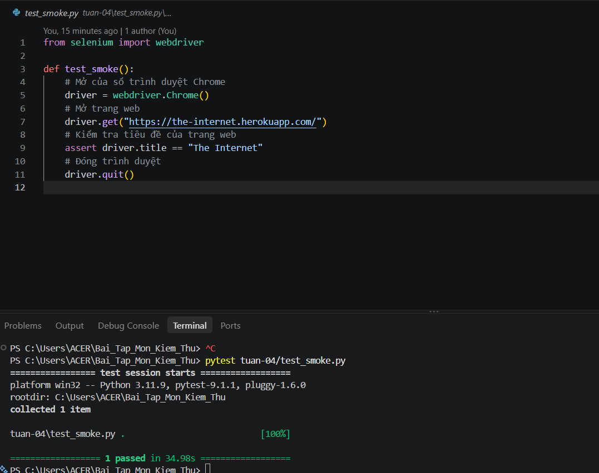

# Tuần 4 – Smoke test với Pytest và Selenium

## 1. Giới thiệu

Bài tập tuần 4 của môn Kiểm thử phần mềm: viết một ca kiểm thử tự động đầu tiên (smoke test) bằng **Pytest** kết hợp **Selenium WebDriver**.

Ca kiểm thử mở trình duyệt Chrome, truy cập trang <https://the-internet.herokuapp.com/> và kiểm tra tiêu đề trang. Mục đích là xác nhận môi trường kiểm thử tự động (Python, Pytest, Selenium, Chrome) đã được cài đặt và hoạt động đúng.

Các tệp trong thư mục:

| Tệp | Nội dung |
| --- | --- |
| `test_smoke.py` | Mã nguồn ca kiểm thử |
| `requirements.txt` | Danh sách thư viện cần cài (`pytest`, `selenium`) |
| `image.png` | Ảnh chụp kết quả chạy kiểm thử |
| `t04-notes.md` | Ghi chú tuần 4 |

## 2. Yêu cầu phải có

- **Python 3** và `pip` (bài này được chạy trên Python 3.11.9).
- Trình duyệt **Google Chrome** đã cài trên máy.
- **Kết nối Internet**, vì ca kiểm thử truy cập một trang web thật và Selenium cần tải ChromeDriver ở lần chạy đầu.

Không cần tải ChromeDriver thủ công: Selenium từ bản 4.6 trở lên có Selenium Manager, tự tải driver phù hợp với phiên bản Chrome đang cài.

## 3. Cách cài đặt Pytest và Selenium

Các lệnh dưới đây chạy trong PowerShell, tại thư mục gốc của repo.

**Bước 1 – Tạo và kích hoạt môi trường ảo** (nên làm, để thư viện không lẫn với Python của hệ thống):

```powershell
python -m venv .venv
.venv\Scripts\Activate.ps1
```

**Bước 2 – Cài thư viện** từ tệp `requirements.txt`:

```powershell
pip install -r tuan-04/requirements.txt
```

Hoặc cài trực tiếp từng thư viện:

```powershell
pip install pytest selenium
```

**Bước 3 – Kiểm tra đã cài thành công:**

```powershell
pytest --version
pip show selenium
```

## 4. Cách chạy

Tại thư mục gốc của repo:

```powershell
pytest tuan-04/test_smoke.py
```

Thêm `-v` để xem tên từng ca kiểm thử và trạng thái của nó:

```powershell
pytest tuan-04/test_smoke.py -v
```

Khi chạy, một cửa sổ Chrome sẽ tự mở, tải trang rồi tự đóng lại.

## 5. Nội dung kiểm thử

Tệp `test_smoke.py` có một ca kiểm thử là `test_smoke`:

| Bước | Thao tác | Mã tương ứng |
| --- | --- | --- |
| 1 | Mở cửa sổ trình duyệt Chrome | `driver = webdriver.Chrome()` |
| 2 | Truy cập trang web | `driver.get("https://the-internet.herokuapp.com/")` |
| 3 | Kiểm tra tiêu đề trang | `assert driver.title == "The Internet"` |
| 4 | Đóng trình duyệt | `driver.quit()` |

- **Dữ liệu đầu vào:** URL `https://the-internet.herokuapp.com/`
- **Kết quả mong đợi:** tiêu đề trang đúng bằng `The Internet`
- **Điều kiện đạt:** câu lệnh `assert` ở bước 3 đúng thì ca kiểm thử đạt (passed); nếu tiêu đề khác thì ca kiểm thử không đạt (failed).

## 6. Kết quả

Ca kiểm thử **đạt**: 1 passed trong 34,98 giây.

```text
================= test session starts =================
platform win32 -- Python 3.11.9, pytest-9.1.1, pluggy-1.6.0
rootdir: C:\Users\ACER\Bai_Tap_Mon_Kiem_Thu
collected 1 item

tuan-04\test_smoke.py .                          [100%]

================= 1 passed in 34.98s =================
```

| Ca kiểm thử | Kết quả mong đợi | Kết quả thực tế | Trạng thái |
| --- | --- | --- | --- |
| `test_smoke` | Tiêu đề trang là `The Internet` | Tiêu đề trang là `The Internet` | Đạt |

Ảnh chụp màn hình khi chạy:


